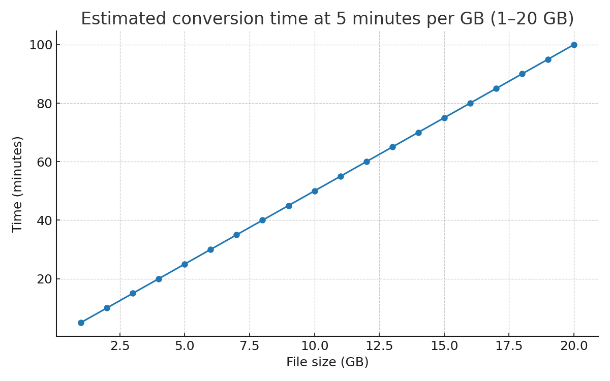

\# las-to-copc


A small Python utility to convert \*\*LAS/LAZ → COPC (`.copc.laz`)\*\* using \*\*PDAL\*\*.  

It supports \*\*single-file\*\* and \*\*whole-folder\*\* processing (non-recursive by default) and prints per-file elapsed time and a final summary.


---


\## Features


\- Convert `.las` / `.laz` to \*\*COPC\*\* (`.copc.laz`) via a PDAL \*\*pipeline\*\*.

\- Optional reprojection (`--in-srs`, `--out-srs`).

\- Control COPC `scale` and `offset` (`auto` supported).

\- Process multiple files \*\*in parallel\*\* with `--workers`.

\- Output name auto-derived as `<input>.copc.laz`, or sent to a custom `--outdir`.


---


\## Requirements


\- \*\*Python\*\* 3.9+

\- \*\*PDAL\*\* 2.6+ with the COPC writer available.


Check your PDAL:

```bash

pdal --version

\# Must list COPC support:

pdal --drivers | grep -i copc        # Linux/Mac

\# or on Windows:

pdal --drivers | findstr /i copc


Quick install (Conda recommended)

conda create -n copc -c conda-forge python=3.10 pdal libcopc laszip laz-perf

conda activate copc


Quick Start

\# Single file → writes input.copc.laz next to the input

python las\_to\_copc.py input.las


\# Convert a whole folder (non-recursive)

python las\_to\_copc.py D:\\data --glob "\*.laz" --workers 4 --outdir D:\\data\\copc --overwrite


\# Reproject while converting

python las\_to\_copc.py input.las --in-srs EPSG:32647 --out-srs EPSG:4978


\# Set COPC scale/offset (offset can be numbers or 'auto')

python las\_to\_copc.py input.las --scale 0.001 0.001 0.001 --offset auto auto auto


Command-Line Arguments

python las\_to\_copc.py <path> \[options]


<path>          A .las/.laz file or a folder.

--glob PATTERN  When <path> is a folder, select files (default: "\*.las").

-o, --outdir    Output directory (default: alongside each input file).

--in-srs EPSG   Input CRS (e.g., EPSG:32647).

--out-srs EPSG  Output CRS (e.g., EPSG:4978).

--scale SX SY SZ        COPC scale (e.g., 0.001 0.001 0.001).

--offset OX OY OZ       COPC offset (numbers or 'auto').

--workers N      Parallel processes (file-level parallelism).

--overwrite      Overwrite existing outputs.
```

## Conversion speed chart



